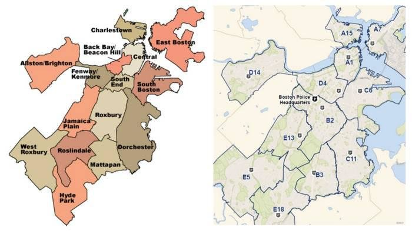
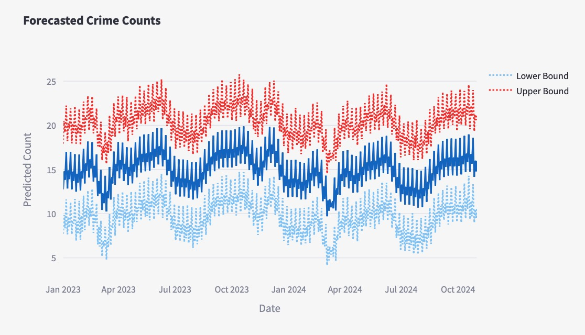
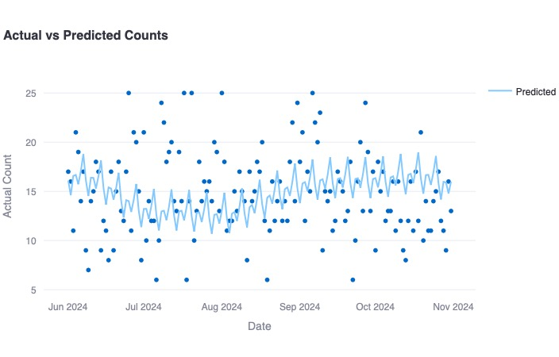
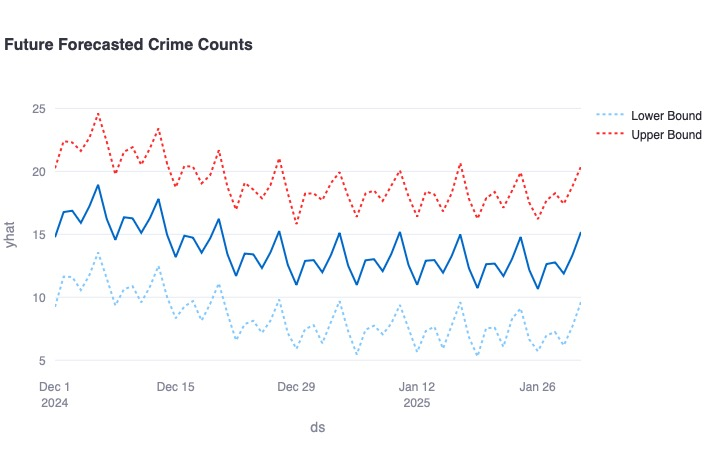
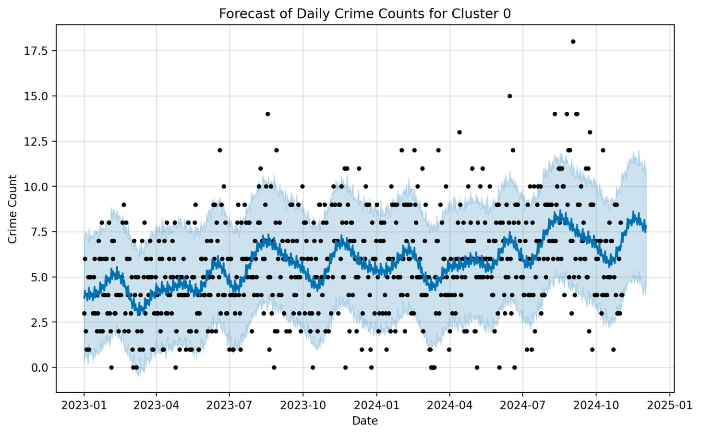
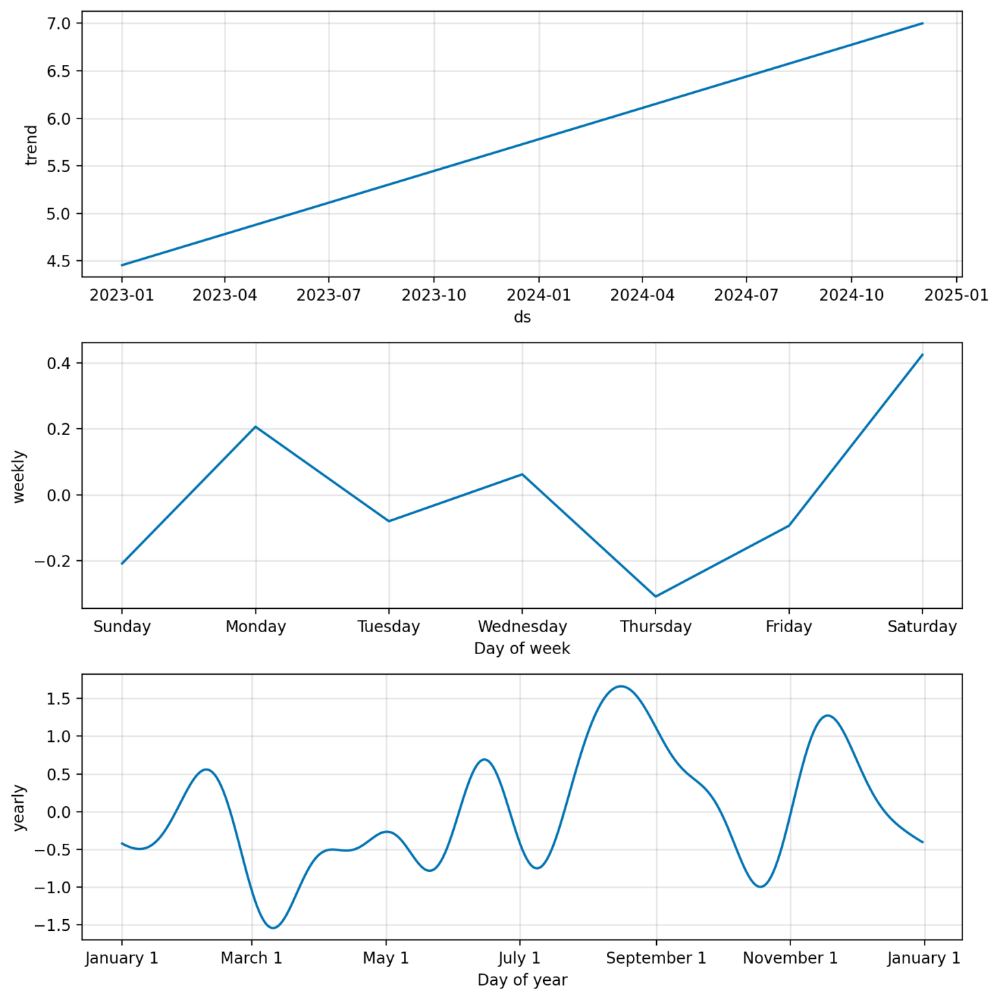
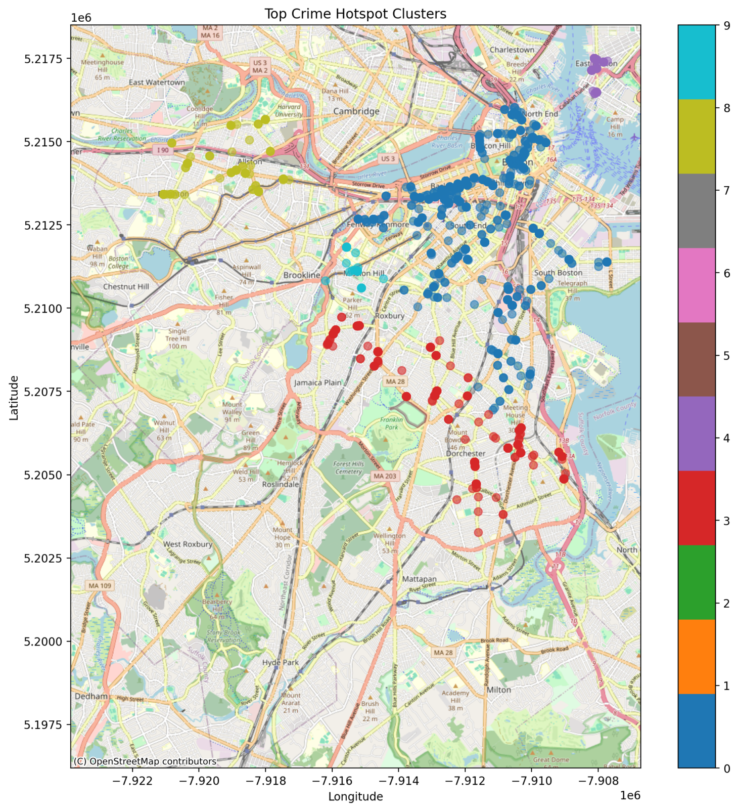

# CS506 Final Project Report #

## How to Build and Run the Code

To reproduce the results of this project, follow these instructions:

**Note:** Ensure you are using Python 3.10 as the code is tested and compatible with this version. If your main Python version is different (e.g., 3.13), you must have Python 3.10 installed on your system. You can download it via [python.org](https://www.python.org/) or use a package manager like Homebrew:

```bash
brew install python@3.10
```

If you need to manage Python versions, ensure you're using Python 3.10 for the following steps.

1. **(Optional) Set up a Virtual Environment:**

    If you want to use a virtual environment to manage dependencies for Python 3.10, run:

    ```bash
    make venv
    ```

    This will create a Python virtual environment. To activate the virtual environment, run:

    ```bash
    . venv/bin/activate
    ```

    If you're not using a virtual environment, ensure all dependencies are installed globally for Python 3.10.

2. **Install Dependencies:**

    ```bash
    make install
    ```

    This installs all the necessary Python libraries specified in the `requirements.txt` file.

3. **Run the Forecasting Model:**

    ```bash
    make forecast
    ```

    This will execute the `forecast_model.py` script, which processes the data, trains the forecasting models, and generates predictions.

4. **Launch the Dashboard:**

    ```bash
    make run_dashboard
    ```

    This runs a Streamlit app (`app.py`) to visualize the crime data, predictions, and insights interactively.


# Data Description, Relevance, And Provenance # 

The data for this project is sourced from publicly available datasets provided on the Boston.gov website. Initially, our project proposal included plans to web-scrape the Citizen App for real-time crime data. However, after submitting the Midterm Report, we identified several challenges with this approach. Firstly, we realized that predicting crime trends and hot spots requires a substantial historical dataset, far exceeding the 1.5 months of data since the semester elapsed. Secondly, the process of scraping Citizen App data and converting HAR files to CSV format introduced numerous formatting issues, which compromised data reliability and usability. Upon further analysis, we determined that the publicly available datasets, which encompass a comprehensive record of crimes across Boston, were far more suitable for our objectives. This adjustment allowed us to leverage a richer dataset, facilitating more accurate and meaningful predictions while avoiding unnecessary preprocessing complications. This shift also ensures that our analysis aligns with standardized, verified data sources, enhancing the reliability of our results.

Crime data analysis is crucial in understanding the disparities and socio-economic challenges across different Boston communities. Historically, the city has faced significant issues related to inequitable policing practices, with certain districts experiencing heavier policing and disproportionate criminalization compared to others. These practices often exacerbate underlying socio-economic problems, such as poverty, unemployment, and lack of access to education and healthcare, which are key factors influencing crime rates. By analyzing crime data at the district level, this project aims to provide insights into the temporal and spatial distribution of crime, which could inform more equitable resource allocation and policymaking. Such an approach has the potential to address systemic inequalities by shifting the focus from punitive measures to preventive and community-centered strategies, ultimately fostering a more just and balanced approach to public safety.

The primary data used in this project is sourced from publicly available crime datasets provided by the Boston.gov website. These datasets represent a verified and standardized record of crime incidents across the city, ensuring the reliability and consistency of the analysis. While our initial proposal included plans to scrape real-time data from the Citizen App, limitations such as data incompleteness and formatting challenges led us to shift to this official source. The Boston.gov datasets include comprehensive historical records of reported crimes, encompassing all districts and crime types. This change in data source not only enhanced the robustness of our predictions but also aligned the project with trusted and validated data, ensuring credibility and relevance in addressing the broader socio-economic disparities tied to crime and policing in Boston.

# Data Processing For District-Based Forecasting #

The data processing workflow for our project was meticulously designed to prepare  crime data for time-series forecasting for each given district in Boston. Raw crime data is preprocessed using the load_and_preprocess_data() function, resulting in a structured dataset with columns for DATE, DISTRICT, and COUNT, respectively. The components represent the daily crime counts for each police district. The data is further segmented into three distinct temporal subsets: a training period (January 1, 2023, to May 31, 2024), a testing period (June 1, 2024, to October 31, 2024), and a future forecasting period (December 2024 to January 2025). To maintain the reliability of the analysis, the data is filtered for each district, ensuring that only districts with a minimum of 10 training records are included. This district-specific preprocessing guarantees that the dataset is both clean and sufficiently comprehensive for generating accurate forecasts, while also tailoring the analysis to localized crime patterns. Additionally, by segmenting districts, we focus on our objective of real-life allocation. 

# Modeling For District-Based Forecasting # 

The modeling strategy employs the Prophet algorithm, which is a robust and scalable time-series forecasting model well-suited for district-level crime data. A unique Prophet model is trained for each district, and utilizes historical crime data from the training period to capture localized crime trends. The model is then configured to incorporate yearly and weekly seasonality, reflecting periodic fluctuations in crime rates, while daily seasonality is excluded to minimize overfitting.

For each district, the trained model generates forecasts for the testing period (June 1, 2024, to October 31, 2024), enabling an evaluation of its predictive performance. Forecast outputs include predicted crime counts (yhat) along with confidence intervals (yhat_lower and yhat_upper) to quantify uncertainty. The model is further extended to produce forecasts for a two-month future period (December 2024 to January 2025), providing actionable insights into anticipated crime trends at the district level. By developing separate models for each district, the methodology ensures that localized patterns and temporal dynamics are accurately reflected, enhancing the precision and relevance of the forecasts for policy-making and resource allocation.

# Visualizations # 

Figure 1. Treemap of major crime incident reports in Boston. The top 5 crime incidents are: investigate person, sick assist, motor vehicle leaving scene with property damage, investigate property, and towed motor vehicle. 



Figure 2. Map of Boston segmented into its respective districts. This visualization highlights the geographic boundaries of each district, providing spatial context for the analysis of crime data. 



Figure 3. Forecasted crime counts for January 2023 to October 2024, showing predicted values with upper and lower confidence bounds. The solid line represents the predicted crime counts, while the dotted lines indicate the upper and lower limits of the forecast. The results reveal consistent periodic patterns of criminal activity, with counts generally ranging between 10 and 20 incidents, and peaks occasionally nearing 25. The relatively narrow confidence intervals demonstrate a high level of confidence in the model’s predictions, suggesting that the crime patterns exhibit strong seasonal or cyclical trends over the observed period. This analysis provides valuable insights into temporal crime dynamics, which can aid in strategic resource allocation and planning.



Figure 4. Actual vs. predicted crime counts for the testing period (June 2024 to October 2024). The scatter plot represents actual crime counts, while the solid line illustrates the model’s predicted values. The model captures the overall trend in crime activity, aligning closely with the general pattern of incidents. However, some deviations between actual and predicted values are observed, particularly during spikes or drops in crime counts, highlighting the variability in criminal activity and the need for further refinement in capturing anomalies.



Figure 5. Forecasted crime counts for December 2024 to January 2025 in a selected Boston district (D14). The predictions show periodic fluctuations, with crime counts ranging from 10 to 20 incidents and occasional peaks approaching 25. The solid line represents the predicted values, while the dotted lines indicate the upper and lower confidence intervals. These trends suggest a consistent pattern of criminal activity during the forecasted period, providing valuable insights for resource planning and allocation.

## Crime Type Analysis ##

In this subsection, we examine specific crime types—larceny and shoplifting—as examples. The analysis includes the following:

1. **Forecast Graph:** This graph shows the forecasted counts for the selected crime types. It is similar to the district-based forecast but focuses on specific crime categories.

   

   For the forecast from January 2023 to January 2025, the black dots represent the actual values, while the blue line indicates the prediction. We observe that near the end of the forecast period, there is no data available, but the prediction continues to follow the established trend, demonstrating the model's ability to extrapolate based on historical patterns.


2. **Time Series Graph:** This graph displays the historical trends in the selected crime types, providing insights into temporal patterns.

   

   The graph spans from January 2023 to January 2025 and breaks down the time series data into three components:

   - **Trend:** This shows the long-term increase or decrease in crime counts, reflecting broader changes over the forecast period.
   - **Weekly:** This highlights patterns that repeat on a weekly basis, such as higher or lower crime rates on specific days of the week.
   - **Yearly:** This captures recurring annual patterns, showing how crime counts fluctuate over the course of a year.


3. **Clustering Graph:** This map highlights the areas with the highest density of the selected crime types. The clustering is ranked from 0 (most dense) to 9 (least dense).

   

   In this map, we observe that the area near Newbury Street has the highest cluster density for shoplifting, which aligns with its status as a popular shopping hotspot. Conversely, areas like Mission Hill, which are primarily residential, exhibit much lower density, reflecting the different socio-economic and activity patterns of these locations.


# Achieving Our Goals # 
As outlined in our Midterm Report, the primary objective of this project was to predict crime types and occurrences within the Boston Metro Area. By focusing on individual districts, we were able to develop a more detailed understanding of when and where crimes are most likely to occur. These predictions have the potential to support the effective allocation and management of critical city resources, such as law enforcement and public safety initiatives. However, we recognize the importance of incorporating socio-economic factors into our analysis to ensure a more holistic understanding of the underlying drivers of crime. By doing so, we aim to provide deeper insights into the severity and context of criminal activity, enabling city planners and policymakers to better address systemic issues and allocate resources more equitably. Additionally, this approach could serve as a foundation for future studies to explore interventions that reduce crime while addressing its root causes.


